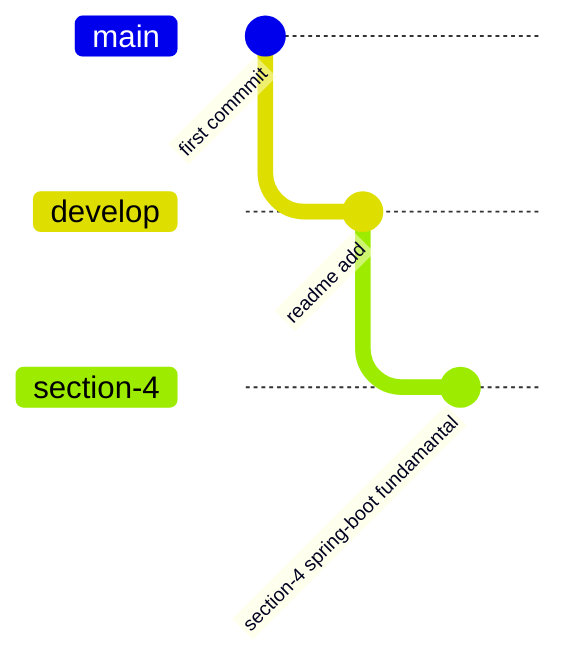

```mermaid
gitGraph
  checkout main
  commit id: "first commmit"
  branch develop
  checkout develop
  commit id: "readme add"
  branch section-4
  checkout section-4
  commit id: "section-4 spring-boot fundamantal"
```
